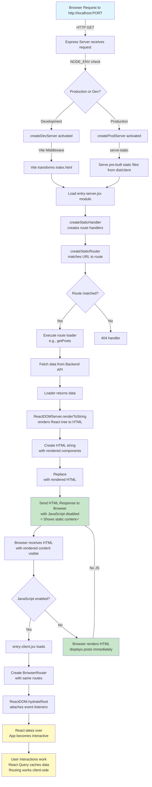

# Full-Stack React SSR Application Architecture

## Server-Side Rendering (SSR) Workflow



---

## Request → Response Flow (Step-by-Step)

### 1. **Browser makes HTTP request**

- Request reaches: `GET /` or `/signup` or `/login`

### 2. **Express server intercepts**

- Route through `server.js`
- Request enters the middleware chain

### 3. **Environment check**

- `NODE_ENV` determines dev/prod mode
- **Dev Mode**: Uses Vite middleware for HMR (hot module replacement)
- **Prod Mode**: Serves pre-built files from `dist/` folder

### 4. **Route Matching**

- React Router's `createStaticRouter` matches URL to a route
- Routes defined in `src/routes.jsx`

### 5. **Data Fetching**

- Executes loader (e.g., `getPosts()`) to fetch data from backend
- Backend API processes request and returns data

### 6. **Component Rendering**

- `ReactDOMServer.renderToString()` converts React components to HTML string
- All components are rendered on the server with actual data

### 7. **HTML Assembly**

- Injects rendered HTML into template
- Replaces `<!--ssr-outlet-->` placeholder with actual HTML

### 8. **Response Sent**

- Browser receives complete HTML with content already rendered ✓
- Response includes both static HTML and JavaScript bundles

### 9. **Browser Rendering**

- **If JavaScript disabled**: Shows static HTML immediately (posts appear!)
- **If JavaScript enabled**:
  - Loads `entry-client.jsx`
  - Hydrates React via `ReactDOM.hydrateRoot()`
  - App becomes interactive

---

## How Initial Data Approach Works

Your app uses **React Router 6.4+ data loaders + Server-Side Rendering**:

```
Route Definition (routes.jsx)
    ↓
Server executes loader before rendering
    ↓
Data passed to component via useLoaderData()
    ↓
Component renders with real data on server
    ↓
HTML sent to browser with actual content
    ↓
JavaScript disabled = Content visible! ✓
JavaScript enabled = React hydrates and takes over
```

### Key Components:

1. **routes.jsx** - Defines routes with loaders

   ```javascript
   loader: async () => {
     try {
       return await getPosts();
     } catch (error) {
       console.error("Error loading posts:", error);
       return [];
     }
   };
   ```

2. **entry-server.jsx** - Server rendering entry point
   - Creates static router
   - Executes loaders
   - Renders React tree to string

3. **entry-client.jsx** - Client hydration entry point
   - Uses `ReactDOM.hydrateRoot()`
   - Attaches React to existing DOM
   - Makes app interactive

4. **Blog.jsx** - Main page component
   - Uses `useLoaderData()` to get server-rendered data
   - React Query handles client-side caching and refetching

---

## Standards Compliance Checklist

| Aspect                      | Status             | Details                                                               |
| --------------------------- | ------------------ | --------------------------------------------------------------------- |
| **SSR Implementation**      | ✅ Complete        | Uses React Router 6.4+ data loaders + ReactDOMServer.renderToString() |
| **Hydration**               | ✅ Correct         | `ReactDOM.hydrateRoot()` properly attaches to DOM                     |
| **Routing Architecture**    | ✅ Modern          | React Router v6 with uniform routes for server & client               |
| **Data Fetching on Server** | ✅ Proper          | Route loaders fetch data before rendering                             |
| **Environment Separation**  | ✅ Good            | Separate dev (Vite) and prod (pre-built) flows                        |
| **Build Process**           | ✅ Correct         | Builds both client & server bundles                                   |
| **CSS-in-JS/Styling**       | ✅ Good            | Tailwind CSS handled properly during SSR                              |
| **Error Handling**          | ✅ Partial         | Try-catch blocks present, but could be more robust                    |
| **State Management**        | ✅ Good            | React Context (Auth) + React Query (data)                             |
| **Request Headers**         | ✅ Good            | `createFetchRequest()` properly converts Express req to Fetch API     |
| **Compression**             | ✅ Present         | `compression` middleware in production                                |
| **Static File Serving**     | ✅ Correct         | `serve-static` for dist/client folder                                 |
| **SEO Optimization**        | ❌ Not Implemented | No dynamic meta tags, canonical URLs, or structured data              |

---

## What's Missing or Could Be Improved

### ⚠️ **Issues Found:**

#### 1. **No SEO Meta Tags**

- Missing dynamic `<meta>` tags for title, description, OG tags
- No canonical URLs
- No structured data (JSON-LD)
- _Note: Intentionally excluded per your request, but important for production_

#### 2. **No Error Boundary for SSR failures**

- If loader throws error, server crashes or returns plain error
- Should have graceful error handling with fallback UI

#### 3. **No Data Serialization for Hydration**

- React Query data isn't embedded in HTML for client-side reuse
- Results in unnecessary API calls on client after hydration
- Should use `window.__INITIAL_DATA__` pattern

#### 4. **Authentication Context Resets on Hydration**

- `AuthContext` token is lost when browser doesn't have persistent storage
- Token should be passed from server to client
- Consider server-side session management

#### 5. **No Streaming SSR**

- Using `renderToString` instead of `renderToPipeableStream`
- Could send HTML faster with streaming for better Time To First Byte (TTFB)

#### 6. **No 404/Error Status Codes**

- Server doesn't return 404 status code when route not found
- All responses return 200 OK regardless of route validity

#### 7. **Missing CSRF Protection**

- If forms are added, need CSRF tokens
- Important for secure API calls

#### 8. **No Content Security Policy (CSP)**

- Should add CSP headers for security

#### 9. **Limited Request Validation**

- No validation of incoming requests on server

---

## Architecture Strengths ✨

✅ **Proper SSR Pattern**

- Routes defined once, used on both server and client
- Eliminates route duplication

✅ **Works Without JavaScript**

- Initial content loads immediately
- Accessible to users with JS disabled
- Better for search engines

✅ **Hydration Ready**

- Client takes over seamlessly when JS loads
- No content shifting or hydration mismatches

✅ **Scalable Build Process**

- Separate client and server bundles
- Server bundle can be deployed independently

✅ **Clean Separation**

- Dev and prod modes properly handled
- Different optimization strategies for each

✅ **Modern Tooling**

- Vite for fast dev experience
- Proper production builds with optimization

✅ **State Management**

- React Context for auth state
- React Query for server state
- Clean separation of concerns

✅ **Backend Integration**

- Proper Express integration
- Middleware chain for SSR rendering
- Environment variable support

---

## File Structure Overview

```
ch5_Deployment/
├── server.js                 # Express server with SSR logic
├── src/
│   ├── entry-server.jsx     # Server rendering entry point
│   ├── entry-client.jsx     # Client hydration entry point
│   ├── App.jsx              # Root app component (providers)
│   ├── routes.jsx           # Route definitions with loaders
│   ├── request.js           # Express req → Fetch API converter
│   ├── pages/
│   │   ├── Blog.jsx         # Main blog page (with SSR)
│   │   ├── Login.jsx        # Login page
│   │   └── Signup.jsx       # Signup page
│   ├── components/          # React components
│   ├── contexts/            # React Context providers
│   ├── api/                 # API client functions
│   └── index.css            # Global styles (Tailwind)
├── public/                  # Static assets
├── dist/                    # Build output (generated)
│   ├── client/              # Client-side bundle
│   └── server/              # Server-side bundle
├── vite.config.js          # Vite configuration
├── package.json            # Dependencies & scripts
└── index.html              # HTML template
```

---

## Quick Fixes Required

### **Issue: `server.js` Error - "Cannot read properties of undefined (reading 'listen')"**

**Location:** `server.js` line 66

**Problem:** `return app;` is inside the middleware handler in `createProdServer()`, causing the function to return `undefined`

**Current (Wrong):**

```javascript
app.use("*", async (req, res, next) => {
  try {
    // ... handler code
  } catch (error) {
    next(error);
  }
  return app; // ❌ WRONG - inside middleware
});
```

**Fix (Correct):**

```javascript
app.use("*", async (req, res, next) => {
  try {
    // ... handler code
  } catch (error) {
    next(error);
  }
});

return app; // ✅ CORRECT - outside middleware at function end
```

---

## Key Technologies Used

| Technology       | Purpose                   | Version |
| ---------------- | ------------------------- | ------- |
| **React**        | UI library                | 18.2.0  |
| **React Router** | Routing with data loaders | 6.21.0  |
| **React Query**  | Server state management   | 5.12.2  |
| **Vite**         | Build tool & dev server   | 5.0.0   |
| **Express**      | Backend server            | 4.18.2  |
| **Tailwind CSS** | Styling                   | 4.3.1   |
| **React DOM**    | Client hydration          | 18.2.0  |

---

## Development Commands

```bash
# Development mode (with Vite HMR)
npm run dev

# Production build
npm run build

# Production start
npm start

# Build client only
npm run build:client

# Build server only
npm run build:server

# Linting
npm run lint
```

---

## How It Achieves No-JS Support

1. **Server fetches all data** before rendering
2. **Server renders components to static HTML** with actual data baked in
3. **HTML is sent to browser** complete with content
4. **Browser displays HTML** without needing JavaScript
5. **Posts appear immediately** (no loading state!)

**Result:** Works perfectly with JavaScript disabled ✓

---

## Deployment Considerations

When deploying to production:

1. Build both client and server bundles: `npm run build`
2. Set `NODE_ENV=production`
3. Use a process manager (PM2, systemd, etc.)
4. Set proper environment variables (`VITE_BACKEND_URL`, `PORT`)
5. Add reverse proxy (nginx) with caching headers
6. Consider CDN for static client assets
7. Monitor server logs for SSR errors
8. Add error tracking (Sentry, etc.)
